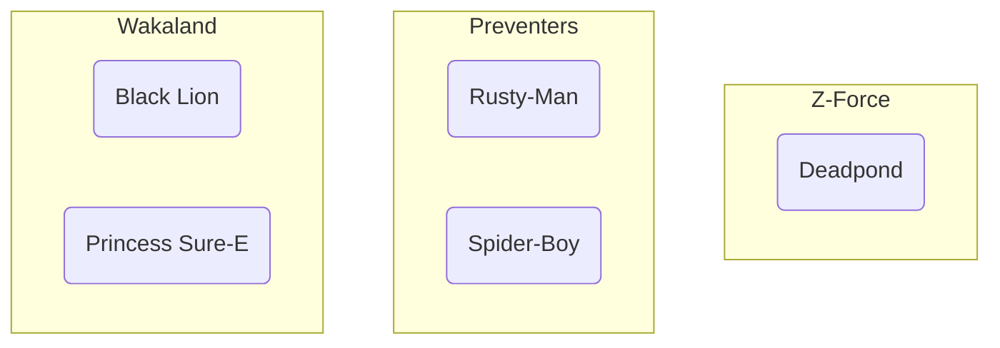
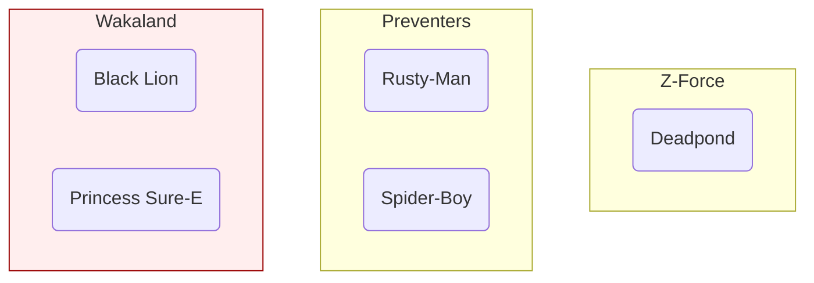
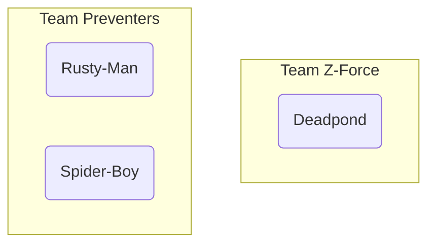
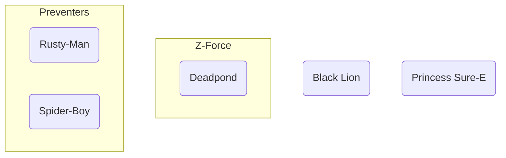

# Cascade Delete Relationships

What happens if we **delete** a team that has a **relationship** with heroes?

Should those heroes be **automatically deleted** too? That's called a "**cascade**", because the initial deletion causes a cascade of other deletions.

Should their `team_id` instead be set to `NULL` in the database?

Let's see how to configure that with **SQLModel**.

/// info

This feature, including `cascade_delete`, `ondelete`, and `passive_deletes`, is available since SQLModel version `0.0.21`.

///

## Initial Heroes and Teams

Let's say that we have these **teams** and **heroes**.

### Team Table

| id   | name       | headquarters          |
| ---- | ---------- | --------------------- |
| 1    | Z-Force    | Sister Margaret's Bar |
| 2    | Preventers | Sharp Tower           |
| 3    | Wakaland   | Wakaland Capital City |

### Hero Table

| id   | name            | secret_name      | age  | team_id |
| ---- | --------------- | ---------------- | ---- | ------- |
| 1    | Deadpond        | Dive WIlson      |      | 1       |
| 2    | Rusty-Man       | Tommy Sharp      | 48   | 2       |
| 3    | Spider-Boy      | Pedro Parqueador |      | 2       |
| 4    | Black Lion      | Trevor Challa    | 35   | 3       |
| 5    | Princess Sure-E | Sure-E           |      | 3       |

### Visual Teams and Heroes

We could visualize them like this:



## Delete a Team with Heroes

When we **delete a team**, we have to do something with the associated heroes.

By default, their foreign key pointing to the team will be set to `NULL` in the database.

But let's say we want the associated heroes to be **automatically deleted**.

For example, we could delete the team `Wakaland`:



And we would want the heroes `Black Lion` and `Princess Sure-E` to be **automatically deleted** too.

So we would end up with these teams and heroes:



## Configure Automatic Deletion

There are **two places** where this automatic deletion is configured:

* in **Python code**
* in the **database**

## Delete in Python with `cascade_delete`

When creating a `Relationship()`, we can set `cascade_delete=True`.

This configures SQLModel to **automatically delete** the related records (heroes) **when the initial one is deleted** (a team).

//// tab | Python 3.10+

```Python hl_lines="9"
{!./docs_src/tutorial/relationship_attributes/cascade_delete_relationships/tutorial001_py310.py[ln:1-9]!}

# Code below omitted 👇
```

////

//// tab | Python 3.9+

```Python hl_lines="11"
{!./docs_src/tutorial/relationship_attributes/cascade_delete_relationships/tutorial001_py39.py[ln:1-11]!}

# Code below omitted 👇
```

////

//// tab | Python 3.7+

```Python hl_lines="11"
{!./docs_src/tutorial/relationship_attributes/cascade_delete_relationships/tutorial001.py[ln:1-11]!}

# Code below omitted 👇
```

////

/// details | 👀 Full file preview

//// tab | Python 3.10+

```Python
{!./docs_src/tutorial/relationship_attributes/cascade_delete_relationships/tutorial001_py310.py!}
```

////

//// tab | Python 3.9+

```Python
{!./docs_src/tutorial/relationship_attributes/cascade_delete_relationships/tutorial001_py39.py!}
```

////

//// tab | Python 3.7+

```Python
{!./docs_src/tutorial/relationship_attributes/cascade_delete_relationships/tutorial001.py!}
```

////

///

With this configuration, when we delete a team, SQLModel (actually SQLAlchemy) will:

* Make sure the objects for the **related records are loaded**, in this case, the `heroes`. If they are not loaded, it will send a `SELECT` query to the database to get them.
* Send a `DELETE` query to the database **including each related record** (each hero).
* Finally, **delete the initial record** (the team) with another `DELETE` query.

This way, the internal **Python code** will take care of deleting the related records, by emitting the necessary SQL queries for each of them.

/// tip

The `cascade_delete` parameter is set in the `Relationship()`, on the model that **doesn't have a foreign key**.

///

/// note | Technical Details

Setting `cascade_delete=True` in the `Relationship()` will configure SQLAlchemy to use `cascade="all, delete-orphan"`, which is the most common and useful configuration when wanting to cascade deletes.

You can read more about it in the <a href="https://docs.sqlalchemy.org/en/20/orm/cascades.html" class="external-link" target="_blank">SQLAlchemy docs</a>.

///

## Delete in the Database with `ondelete`

In the previous section we saw that using `cascade_delete` handles automatic deletions from the Python code.

But what happens if someone **interacts with the database directly**, not using our code, and **deletes a team with SQL**?

For those cases, we can configure the database to **automatically delete** the related records with the `ondelete` parameter in `Field()`.

### `ondelete` Options

The `ondelete` parameter will set a SQL `ON DELETE` in the **foreign key column** in the database.

`ondelete` can have these values:

* `CASCADE`: **Automatically delete this record** (hero) when the related one (team) is deleted.
* `SET NULL`: Set this **foreign key** (`hero.team_id`) field to `NULL` when the related record is deleted.
* `RESTRICT`: **Prevent** the deletion of this record (hero) if there is a foreign key value by raising an error.

## Set `ondelete` to `CASCADE`

If we want to configure the database to **automatically delete** the related records when the parent is deleted, we can set `ondelete="CASCADE"`.

//// tab | Python 3.10+

```Python hl_lines="18"
{!./docs_src/tutorial/relationship_attributes/cascade_delete_relationships/tutorial001_py310.py[ln:1-19]!}

# Code below omitted 👇
```

////

//// tab | Python 3.9+

```Python hl_lines="21"
{!./docs_src/tutorial/relationship_attributes/cascade_delete_relationships/tutorial001_py39.py[ln:1-23]!}

# Code below omitted 👇
```

////

//// tab | Python 3.7+

```Python hl_lines="21"
{!./docs_src/tutorial/relationship_attributes/cascade_delete_relationships/tutorial001.py[ln:1-23]!}

# Code below omitted 👇
```

////

/// details | 👀 Full file preview

//// tab | Python 3.10+

```Python
{!./docs_src/tutorial/relationship_attributes/cascade_delete_relationships/tutorial001_py310.py!}
```

////

//// tab | Python 3.9+

```Python
{!./docs_src/tutorial/relationship_attributes/cascade_delete_relationships/tutorial001_py39.py!}
```

////

//// tab | Python 3.7+

```Python
{!./docs_src/tutorial/relationship_attributes/cascade_delete_relationships/tutorial001.py!}
```

////

///

Now, when we **create the tables** in the database, the `team_id` column in the `Hero` table will have an `ON DELETE CASCADE` in its definition at the database level.

This will **configure the database** to **automatically delete** the records (heroes) when the related record (team) is deleted.

/// tip

The `ondelete` parameter is set in the `Field()`, on the model that **has a foreign key**.

///

## Using `cascade_delete` or `ondelete`

At this point, you might be wondering if you should use `cascade_delete` or `ondelete`. The answer is: **both**! 🤓

The `ondelete` will **configure the database**, in case someone interacts with it directly.

But `cascade_delete` is still needed to tell SQLAlchemy that it should delete the **Python objects** in memory.

### Foreign Key Constraint Support

Some databases don't support foreign key constraints.

For example, **SQLite** doesn't support them by default. They have to be manually enabled with a custom SQL command:

```
PRAGMA foreign_keys = ON;
```

So, in general is a good idea to have both `cascade_delete` and `ondelete` configured.

/// tip

You will learn more about how to **disable the default** automatic SQLModel (SQLAlchemy) behavior and **only rely on the database** down below, in the section about `passive_deletes`.

///

### `cascade_delete` on `Relationship()` and `ondelete` on `Field()`

Just a note to remember... 🤓

* `ondelete` is put on the `Field()` with a **foreign key**. On the **"many"** side in "one-to-many" relationships.

```Python
class Hero(SQLModel, table=True):
    ...

    team_id: int Field(foreign_key="team.id", ondelete="CASCADE")
```

* `cascade_delete` is put on the `Relationship()`. Normally on the **"one"** side in "one-to-many" relationships, the side **without a foreign key**.

```Python
class Team(SQLModel, table=True):
    ...

    heroes: list[Hero] = Relationship(cascade_delete=True)
```

## Remove a Team and its Heroes

Now, when we **delete a team**, we don't need to do anything else, it's **automatically** going to **delete its heroes**.

//// tab | Python 3.10+

```Python hl_lines="7"
# Code above omitted 👆

{!./docs_src/tutorial/relationship_attributes/cascade_delete_relationships/tutorial001_py310.py[ln:76-82]!}

# Code below omitted 👇
```

////

//// tab | Python 3.9+

```Python hl_lines="7"
# Code above omitted 👆

{!./docs_src/tutorial/relationship_attributes/cascade_delete_relationships/tutorial001_py39.py[ln:80-86]!}

# Code below omitted 👇
```

////

//// tab | Python 3.7+

```Python hl_lines="7"
# Code above omitted 👆

{!./docs_src/tutorial/relationship_attributes/cascade_delete_relationships/tutorial001.py[ln:80-86]!}

# Code below omitted 👇
```

////

/// details | 👀 Full file preview

//// tab | Python 3.10+

```Python
{!./docs_src/tutorial/relationship_attributes/cascade_delete_relationships/tutorial001_py310.py!}
```

////

//// tab | Python 3.9+

```Python
{!./docs_src/tutorial/relationship_attributes/cascade_delete_relationships/tutorial001_py39.py!}
```

////

//// tab | Python 3.7+

```Python
{!./docs_src/tutorial/relationship_attributes/cascade_delete_relationships/tutorial001.py!}
```

////

///

## Confirm Heroes are Deleted

We can confirm that **after deleting the team** `Wakaland`, the heroes `Black Lion` and `Princess Sure-E` are **also deleted**.

If we try to select them from the database, we will **no longer find them**.

//// tab | Python 3.10+

```Python hl_lines="5  8  10  13"
# Code above omitted 👆

{!./docs_src/tutorial/relationship_attributes/cascade_delete_relationships/tutorial001_py310.py[ln:85-95]!}

# Code below omitted 👇
```

////

//// tab | Python 3.9+

```Python hl_lines="5  8  10  13"
# Code above omitted 👆

{!./docs_src/tutorial/relationship_attributes/cascade_delete_relationships/tutorial001_py39.py[ln:89-99]!}

# Code below omitted 👇
```

////

//// tab | Python 3.7+

```Python hl_lines="5  8  10  13"
# Code above omitted 👆

{!./docs_src/tutorial/relationship_attributes/cascade_delete_relationships/tutorial001.py[ln:89-99]!}

# Code below omitted 👇
```

////

/// details | 👀 Full file preview

//// tab | Python 3.10+

```Python
{!./docs_src/tutorial/relationship_attributes/cascade_delete_relationships/tutorial001_py310.py!}
```

////

//// tab | Python 3.9+

```Python
{!./docs_src/tutorial/relationship_attributes/cascade_delete_relationships/tutorial001_py39.py!}
```

////

//// tab | Python 3.7+

```Python
{!./docs_src/tutorial/relationship_attributes/cascade_delete_relationships/tutorial001.py!}
```

////

///

## Run the Program with `cascade_delete=True` and `ondelete="CASCADE"`

We can confirm everything is working by running the program.

<div class="termy">

```console
$ python app.py

// Some boilerplate and previous output omitted 😉

// The team table is created as before
CREATE TABLE team (
        id INTEGER NOT NULL,
        name VARCHAR NOT NULL,
        headquarters VARCHAR NOT NULL,
        PRIMARY KEY (id)
)

// The hero table is created with the ON DELETE CASCADE 🎉
// In SQLite, it also includes REFERENCES team (id), this is needed by SQLite to work with the ON DELETE CASCADE properly.
// SQLAlchemy takes care of setting it up for us to make sure it works 🤓
CREATE TABLE hero (
        id INTEGER NOT NULL,
        name VARCHAR NOT NULL,
        secret_name VARCHAR NOT NULL,
        age INTEGER,
        team_id INTEGER,
        PRIMARY KEY (id),
        FOREIGN KEY(team_id) REFERENCES team (id) ON DELETE CASCADE
)

// We select the team Wakaland
INFO Engine SELECT team.id, team.name, team.headquarters
FROM team
WHERE team.name = ?
INFO Engine [generated in 0.00014s] ('Wakaland',)

// Then, because of cascade_delete, right before deleting Wakaland, SQLAlchemy loads the heroes
INFO Engine SELECT hero.id AS hero_id, hero.name AS hero_name, hero.secret_name AS hero_secret_name, hero.age AS hero_age, hero.team_id AS hero_team_id
FROM hero
WHERE ? = hero.team_id
INFO Engine [generated in 0.00020s] (3,)

// Next, before deleting the Wakaland team, it sends a DELETE statement including each related hero: Black Lion and Princess Sure-E, with IDs 4 and 5
INFO Engine DELETE FROM hero WHERE hero.id = ?
INFO Engine [generated in 0.00022s] [(4,), (5,)]

// After that, it will send the delete for the team Wakaland with ID 3
INFO Engine DELETE FROM team WHERE team.id = ?
INFO Engine [generated in 0.00017s] (3,)

// Print the deleted team
Deleted team: name='Wakaland' id=3 headquarters='Wakaland Capital City'

// Finally, we try to select the heroes from Wakaland, Black Lion and Princess Sure-E and print them, but they are now deleted
Black Lion not found: None
Princess Sure-E not found: None
```

</div>

## `ondelete` with `SET NULL`

We can configure the database to **set the foreign key** (the `team_id` in the `hero` table) to **`NULL`** when the related record (in the `team` table) is deleted.

In this case, the side with `Relationship()` won't have `cascade_delete`, but the side with `Field()` and a `foreign_key` will have `ondelete="SET NULL"`.

//// tab | Python 3.10+

```Python hl_lines="19"
{!./docs_src/tutorial/relationship_attributes/cascade_delete_relationships/tutorial002_py310.py[ln:1-21]!}

# Code below omitted 👇
```

////

//// tab | Python 3.9+

```Python hl_lines="21"
{!./docs_src/tutorial/relationship_attributes/cascade_delete_relationships/tutorial002_py39.py[ln:1-23]!}

# Code below omitted 👇
```

////

//// tab | Python 3.7+

```Python hl_lines="21"
{!./docs_src/tutorial/relationship_attributes/cascade_delete_relationships/tutorial002.py[ln:1-23]!}

# Code below omitted 👇
```


////

/// details | 👀 Full file preview

//// tab | Python 3.10+

```Python
{!./docs_src/tutorial/relationship_attributes/cascade_delete_relationships/tutorial002_py310.py!}
```

////

//// tab | Python 3.9+

```Python
{!./docs_src/tutorial/relationship_attributes/cascade_delete_relationships/tutorial002_py39.py!}
```

////

//// tab | Python 3.7+

```Python
{!./docs_src/tutorial/relationship_attributes/cascade_delete_relationships/tutorial002.py!}
```

////

///

The configuration above is setting the `team_id` column from the `Hero` table to have an `ON DELETE SET NULL`.

This way, when someone deletes a team from the database using SQL directly, the database will go to the heroes for that team and set `team_id` to `NULL` (if the database supports it).

/// tip

The foreign key should allow `None` values (`NULL` in the database), otherwise you would end up having an Integrity Error by violating the `NOT NULL` constraint.

So `team_id` needs to have a type with `None`, like:

```Python
team_id: int | None
```

///

### Not Using `ondelete="SET NULL"`

What happens if you don't use `ondelete="SET NULL"`, don't set anything on `cascade_delete`, and delete a team?

The default behavior is that SQLModel (actually SQLAlchemy) will go to the heroes and set their `team_id` to `NULL` from the **Python code**.

So, **by default**, those `team_id` fields will be **set to `NULL`**.

But if someone goes to the database and **manually deletes a team**, the heroes could end up with a `team_id` pointing to a non-existing team.

Adding the `ondelete="SET NULL"` configures the database itself to also set those fields to `NULL`.

But if you delete a team from code, by default, SQLModel (actually SQLAlchemy) will update those `team_id` fields to `NULL` even before the database `SET NULL` takes effect.

### Removing a Team with `SET NULL`

Removing a team has the **same code** as before, the only thing that changes is the configuration underneath in the database.

//// tab | Python 3.10+

```Python hl_lines="7"
# Code above omitted 👆

{!./docs_src/tutorial/relationship_attributes/cascade_delete_relationships/tutorial002_py310.py[ln:78-84]!}

# Code below omitted 👇
```

////

//// tab | Python 3.9+

```Python hl_lines="7"
# Code above omitted 👆

{!./docs_src/tutorial/relationship_attributes/cascade_delete_relationships/tutorial002_py39.py[ln:80-86]!}

# Code below omitted 👇
```

////

//// tab | Python 3.7+

```Python hl_lines="7"
# Code above omitted 👆

{!./docs_src/tutorial/relationship_attributes/cascade_delete_relationships/tutorial002.py[ln:80-86]!}

# Code below omitted 👇
```

////

/// details | 👀 Full file preview

//// tab | Python 3.10+

```Python
{!./docs_src/tutorial/relationship_attributes/cascade_delete_relationships/tutorial002_py310.py!}
```

////

//// tab | Python 3.9+

```Python
{!./docs_src/tutorial/relationship_attributes/cascade_delete_relationships/tutorial002_py39.py!}
```

////

//// tab | Python 3.7+

```Python
{!./docs_src/tutorial/relationship_attributes/cascade_delete_relationships/tutorial002.py!}
```

////

///

The result would be these tables.

#### Team Table after `SET NULL`

| id   | name       | headquarters          |
| ---- | ---------- | --------------------- |
| 1    | Z-Force    | Sister Margaret's Bar |
| 2    | Preventers | Sharp Tower           |

#### Hero Table after `SET NULL`

| id   | name            | secret_name      | age  | team_id |
| ---- | --------------- | ---------------- | ---- | ------- |
| 1    | Deadpond        | Dive WIlson      |      | 1       |
| 2    | Rusty-Man       | Tommy Sharp      | 48   | 2       |
| 3    | Spider-Boy      | Pedro Parqueador |      | 2       |
| 4    | Black Lion      | Trevor Challa    | 35   | NULL    |
| 5    | Princess Sure-E | Sure-E           |      | NULL    |

#### Visual Teams and Heroes after `SET NULL`

We could visualize them like this:



### Run the program with `SET NULL`

Let's confirm it all works by running the program now:

<div class="termy">

```console
$ python app.py

// Some boilerplate and previous output omitted 😉

// The hero table is created with the ON DELETE SET NULL 🎉
// In SQLite, it also includes: REFERENCES team (id). This REFERENCES is needed by SQLite to work with the ON DELETE CASCADE properly.
// SQLModel with SQLAlchemy takes care of setting it up for us to make sure it works 🤓
CREATE TABLE hero (
        id INTEGER NOT NULL,
        name VARCHAR NOT NULL,
        secret_name VARCHAR NOT NULL,
        age INTEGER,
        team_id INTEGER,
        PRIMARY KEY (id),
        FOREIGN KEY(team_id) REFERENCES team (id) ON DELETE SET NULL
)

// We select the team Wakaland
INFO Engine SELECT team.id, team.name, team.headquarters
FROM team
WHERE team.id = ?
INFO Engine [generated in 0.00010s] (3,)
Team Wakaland: id=3 name='Wakaland' headquarters='Wakaland Capital City'

// Then, right before deleting Wakaland, the heroes are loaded automatically
INFO Engine SELECT hero.id AS hero_id, hero.name AS hero_name, hero.secret_name AS hero_secret_name, hero.age AS hero_age, hero.team_id AS hero_team_id
FROM hero
WHERE ? = hero.team_id
INFO Engine [generated in 0.00020s] (3,)

// Next, before deleting the Wakaland team, it sends an UPDATE statement including each related hero: Black Lion and Princess Sure-E, with IDs 4 and 5, to set their team_id to NULL. This is not the SET NULL we added, this is just the default SQLModel (SQLAlchemy) behavior.
INFO Engine UPDATE hero SET team_id=? WHERE hero.id = ?
INFO Engine [generated in 0.00009s] [(None, 4), (None, 5)]

// After that, it will send the delete for the team Wakaland with ID 3
INFO Engine DELETE FROM team WHERE team.id = ?
INFO Engine [generated in 0.00017s] (3,)

// Print the deleted team
Deleted team: name='Wakaland' id=3 headquarters='Wakaland Capital City'

// Finally, we select the heroes Black Lion and Princess Sure-E and print them, they no longer have a team
Black Lion has no team: age=35 id=4 name='Black Lion' secret_name='Trevor Challa' team_id=None
Princess Sure-E has no team: age=None id=5 name='Princess Sure-E' secret_name='Sure-E' team_id=None
```

</div>

The team `Wakaland` was deleted and all of its heroes were left without a team, or in other words, with their `team_id` set to `NULL`, but still kept in the database! 🤓

## Let the Database Handle it with `passive_deletes`

In the previous examples we configured `ondelete` with `CASCADE` and `SET NULL` to configure the database to handle the deletion of related records automatically. But we actually **never used that functionality** ourselves, because SQLModel (SQLAlchemy) **by default loads** the related records and **deletes** them or updates them with **NULL** before sending the `DELETE` for the team.

If you know your database would be able to correctly handle the deletes or updates on its own, just with `ondelete="CASCADE"` or `ondelete="SET NULL"`, you can use `passive_deletes="all"` in the `Relationship()` to tell SQLModel (actually SQLAlchemy) to **not delete or update** those records (for heroes) before sending the `DELETE` for the team.

### Enable Foreign Key Support in SQLite

To be able to test this out with SQLite, we first need to enable foreign key support.

//// tab | Python 3.10+

```Python hl_lines="6"
# Code above omitted 👆

{!./docs_src/tutorial/relationship_attributes/cascade_delete_relationships/tutorial003_py310.py[ln:30-33]!}

# Code below omitted 👇
```

////

//// tab | Python 3.9+

```Python hl_lines="6"
# Code above omitted 👆

{!./docs_src/tutorial/relationship_attributes/cascade_delete_relationships/tutorial003_py39.py[ln:32-35]!}

# Code below omitted 👇
```

////

//// tab | Python 3.7+

```Python hl_lines="6"
# Code above omitted 👆

{!./docs_src/tutorial/relationship_attributes/cascade_delete_relationships/tutorial003.py[ln:32-35]!}

# Code below omitted 👇
```

////

/// details | 👀 Full file preview

//// tab | Python 3.10+

```Python
{!./docs_src/tutorial/relationship_attributes/cascade_delete_relationships/tutorial003_py310.py!}
```

////

//// tab | Python 3.9+

```Python
{!./docs_src/tutorial/relationship_attributes/cascade_delete_relationships/tutorial003_py39.py!}
```

////

//// tab | Python 3.7+

```Python
{!./docs_src/tutorial/relationship_attributes/cascade_delete_relationships/tutorial003.py!}
```

////

///

/// info

You can learn more about SQLite, foreign keys, and this SQL command on the <a href="https://docs.sqlalchemy.org/en/20/dialects/sqlite.html#foreign-key-support" class="external-link" target="_blank">SQLAlchemy docs</a>.

///

### Use `passive_deletes="all"`

Now let's update the table model for `Team` to use `passive_deletes="all"` in the `Relationship()` for heroes.

We will also use `ondelete="SET NULL"` in the `Hero` model table, in the foreign key `Field()` for the `team_id` to make the database set those fields to `NULL` automatically.

//// tab | Python 3.10+

```Python hl_lines="9  19"
{!./docs_src/tutorial/relationship_attributes/cascade_delete_relationships/tutorial003_py310.py[ln:1-21]!}

# Code below omitted 👇
```

////

//// tab | Python 3.9+

```Python hl_lines="11  21"
{!./docs_src/tutorial/relationship_attributes/cascade_delete_relationships/tutorial003_py39.py[ln:1-23]!}

# Code below omitted 👇
```

////

//// tab | Python 3.7+

```Python hl_lines="11  21"
{!./docs_src/tutorial/relationship_attributes/cascade_delete_relationships/tutorial003.py[ln:1-23]!}

# Code below omitted 👇
```

////

/// details | 👀 Full file preview

//// tab | Python 3.10+

```Python
{!./docs_src/tutorial/relationship_attributes/cascade_delete_relationships/tutorial003_py310.py!}
```

////

//// tab | Python 3.9+

```Python
{!./docs_src/tutorial/relationship_attributes/cascade_delete_relationships/tutorial003_py39.py!}
```

////

//// tab | Python 3.7+

```Python
{!./docs_src/tutorial/relationship_attributes/cascade_delete_relationships/tutorial003.py!}
```

////

///

### Run the Program with `passive_deletes`

Now, if we run the program, we will see that SQLModel (SQLAlchemy) is no longer loading and updating the heroes, it just sends the `DELETE` for the team.

<div class="termy">

```console
$ python app.py

// Some boilerplate and previous output omitted 😉

// The hero table is created with the ON DELETE SET NULL as before
CREATE TABLE hero (
        id INTEGER NOT NULL,
        name VARCHAR NOT NULL,
        secret_name VARCHAR NOT NULL,
        age INTEGER,
        team_id INTEGER,
        PRIMARY KEY (id),
        FOREIGN KEY(team_id) REFERENCES team (id) ON DELETE SET NULL
)

// For SQLite, we also send the custom command to enable foreign key support
INFO Engine PRAGMA foreign_keys=ON

// We select and print the team Wakaland
Team Wakaland: id=3 name='Wakaland' headquarters='Wakaland Capital City'

// We won't see another SELECT for the heroes, nor an UPDATE or DELETE. SQLModel (with SQLAlchemy) won't try to load and update (or delete) the related records for heroes, it will just send the DELETE for the team right away.
INFO Engine DELETE FROM team WHERE team.id = ?
INFO Engine [generated in 0.00013s] (3,)

// At this point, because we enabled foreign key support for SQLite, the database will take care of updating the records for heroes automatically, setting their team_id to NULL

// Print the deleted team
Deleted team: name='Wakaland' id=3 headquarters='Wakaland Capital City'

// Finally, we select the heroes Black Lion and Princess Sure-E and print them, they no longer have a team
Black Lion has no team: age=35 id=4 name='Black Lion' secret_name='Trevor Challa' team_id=None
Princess Sure-E has no team: age=None id=5 name='Princess Sure-E' secret_name='Sure-E' team_id=None
```

</div>

## `ondelete` with `RESTRICT`

We can also configure the database to **prevent the deletion** of a record (a team) if there are related records (heroes).

In this case, when someone attempts to **delete a team with heroes** in it, the database will **raise an error**.

And because this is configured in the database, it will happen even if someone **interacts with the database directly using SQL** (if the database supports it).

/// tip

For SQLite, this also needs enabling foreign key support.

///

### Enable Foreign Key Support in SQLite for `RESTRICT`

As `ondelete="RESTRICT"` is mainly a database-level constraint, let's enable foreign key support in SQLite first to be able to test it.

//// tab | Python 3.10+

```Python hl_lines="6"
# Code above omitted 👆

{!./docs_src/tutorial/relationship_attributes/cascade_delete_relationships/tutorial004_py310.py[ln:30-33]!}

# Code below omitted 👇
```

////

//// tab | Python 3.9+

```Python hl_lines="6"
# Code above omitted 👆

{!./docs_src/tutorial/relationship_attributes/cascade_delete_relationships/tutorial004_py39.py[ln:32-35]!}

# Code below omitted 👇
```

////

//// tab | Python 3.7+

```Python hl_lines="6"
# Code above omitted 👆

{!./docs_src/tutorial/relationship_attributes/cascade_delete_relationships/tutorial004.py[ln:32-35]!}

# Code below omitted 👇
```

////

/// details | 👀 Full file preview

//// tab | Python 3.10+

```Python
{!./docs_src/tutorial/relationship_attributes/cascade_delete_relationships/tutorial004_py310.py!}
```

////

//// tab | Python 3.9+

```Python
{!./docs_src/tutorial/relationship_attributes/cascade_delete_relationships/tutorial004_py39.py!}
```

////

//// tab | Python 3.7+

```Python
{!./docs_src/tutorial/relationship_attributes/cascade_delete_relationships/tutorial004.py!}
```

////

///

### Use `ondelete="RESTRICT"`

Let's set `ondelete="RESTRICT"` in the foreign key `Field()` for the `team_id` in the `Hero` model table.

And in the `Team` model table, we will use `passive_deletes="all"` in the `Relationship()` for heroes, this way the default behavior of setting foreign keys from deleted models to `NULL` will be disabled, and when we try to delete a team with heroes, the database will **raise an error**.

/// tip

Notice that we don't set `cascade_delete` in the `Team` model table.

///

//// tab | Python 3.10+

```Python hl_lines="9  19"
{!./docs_src/tutorial/relationship_attributes/cascade_delete_relationships/tutorial004_py310.py[ln:1-21]!}

# Code below omitted 👇
```

////

//// tab | Python 3.9+

```Python hl_lines="11  21"
{!./docs_src/tutorial/relationship_attributes/cascade_delete_relationships/tutorial004_py39.py[ln:1-23]!}

# Code below omitted 👇
```

////

//// tab | Python 3.7+

```Python hl_lines="11  21"
{!./docs_src/tutorial/relationship_attributes/cascade_delete_relationships/tutorial004.py[ln:1-23]!}

# Code below omitted 👇
```

////

/// details | 👀 Full file preview

//// tab | Python 3.10+

```Python
{!./docs_src/tutorial/relationship_attributes/cascade_delete_relationships/tutorial004_py310.py!}
```

////

//// tab | Python 3.9+

```Python
{!./docs_src/tutorial/relationship_attributes/cascade_delete_relationships/tutorial004_py39.py!}
```

////

//// tab | Python 3.7+

```Python
{!./docs_src/tutorial/relationship_attributes/cascade_delete_relationships/tutorial004.py!}
```

////

///

### Run the Program with `RESTRICT`, See the Error

Now, if we run the program and try to delete a team with heroes, we will see an error.

<div class="termy">

```console
$ python app.py

// Some boilerplate and previous output omitted 😉

// The hero table is created with the ON DELETE RESTRICT
CREATE TABLE hero (
        id INTEGER NOT NULL,
        name VARCHAR NOT NULL,
        secret_name VARCHAR NOT NULL,
        age INTEGER,
        team_id INTEGER,
        PRIMARY KEY (id),
        FOREIGN KEY(team_id) REFERENCES team (id) ON DELETE RESTRICT
)

// Now, when we reach the point of deleting a team with heroes, we will see an error
Traceback (most recent call last):
     File "/home/user/code...

sqlite3.IntegrityError: FOREIGN KEY constraint failed

// More error output here...

sqlalchemy.exc.IntegrityError: (sqlite3.IntegrityError) FOREIGN KEY constraint failed
[SQL: DELETE FROM team WHERE team.id = ?]
[parameters: (3,)]
```

</div>

Great! The database didn't let us commit the mistake of deleting a team with heroes. 🤓

/// tip

If you want to test if the `PRAGMA foreign_keys=ON` is necessary, **comment that line** and run it again, you will **not see an error**. 😱

The same with `passive_deletes="all"`, if you **comment that line**, SQLModel (SQLAlchemy) will load and update the heroes before deleting the team, set their foreign key `team_id` to `NULL` and **the constraint won't work as expected**, you will not see an error. 😅

///

### Update Heroes Before Deleting the Team

After having the `ondelete="RESTRICT"` in place, SQLite configured to support foreign keys, and `passive_deletes="all"` in the `Relationship()`, if we try to delete a team with heroes, we will see an error.

If we want to delete the team, we need to **update the heroes first** and set their `team_id` to `None` (or `NULL` in the database).

By calling the method `.clear()` from a list, we remove all its items. So, by calling `team.heroes.clear()` and saving that to the database, we disassociate the heroes from the team, that will set their `team_id` to `None`.

/// tip

Calling `team.heroes.clear()` is very similar to what SQLModel (actually SQLAlchemy) would have done if we didn't have `passive_deletes="all"` configured.

///

//// tab | Python 3.10+

```Python hl_lines="7"
# Code above omitted 👆

{!./docs_src/tutorial/relationship_attributes/cascade_delete_relationships/tutorial005_py310.py[ln:80-88]!}

# Code below omitted 👇
```

////

//// tab | Python 3.9+

```Python hl_lines="7"
# Code above omitted 👆

{!./docs_src/tutorial/relationship_attributes/cascade_delete_relationships/tutorial005_py39.py[ln:82-90]!}

# Code below omitted 👇
```

////

//// tab | Python 3.7+

```Python hl_lines="7"
# Code above omitted 👆

{!./docs_src/tutorial/relationship_attributes/cascade_delete_relationships/tutorial005.py[ln:82-90]!}

# Code below omitted 👇
```

////

/// details | 👀 Full file preview

//// tab | Python 3.10+

```Python
{!./docs_src/tutorial/relationship_attributes/cascade_delete_relationships/tutorial005_py310.py!}
```

////

//// tab | Python 3.9+

```Python
{!./docs_src/tutorial/relationship_attributes/cascade_delete_relationships/tutorial005_py39.py!}
```

////

//// tab | Python 3.7+

```Python
{!./docs_src/tutorial/relationship_attributes/cascade_delete_relationships/tutorial005.py!}
```

////

///

### Run the Program Deleting Heroes First

Now, if we run the program and delete the heroes first, we will be able to delete the team without any issues.

<div class="termy">

```console
$ python app.py

// Some boilerplate and previous output omitted 😉

// The hero table is created with the ON DELETE RESTRICT
CREATE TABLE hero (
        id INTEGER NOT NULL,
        name VARCHAR NOT NULL,
        secret_name VARCHAR NOT NULL,
        age INTEGER,
        team_id INTEGER,
        PRIMARY KEY (id),
        FOREIGN KEY(team_id) REFERENCES team (id) ON DELETE RESTRICT
)

// We manually disassociate the heroes from the team
INFO Engine UPDATE hero SET team_id=? WHERE hero.id = ?
INFO Engine [generated in 0.00008s] [(None, 4), (None, 5)]

// We print the team from which we removed heroes
Team with removed heroes: name='Wakaland' id=3 headquarters='Wakaland Capital City'

// Now we can delete the team
INFO Engine DELETE FROM team WHERE team.id = ?
INFO Engine [generated in 0.00008s] (3,)
INFO Engine COMMIT
Deleted team: name='Wakaland' id=3 headquarters='Wakaland Capital City'

// The heroes Black Lion and Princess Sure-E are no longer associated with the team
Black Lion has no team: secret_name='Trevor Challa' name='Black Lion' team_id=None age=35 id=4
Princess Sure-E has no team: secret_name='Sure-E' name='Princess Sure-E' team_id=None age=None id=5
```

</div>

## Conclusion

In many cases, **you don't really need to configure anything**. 😎

In some cases, when you want to **cascade** the delete of a record to its related records automatically (delete a team with its heroes), you can:

* Use `cascade_delete=True` in the `Relationship()` on the side **without a foreign key**
* And use `ondelete="CASCADE"` in the `Field()` with the **foreign key**

That will **cover most of the use cases**. 🚀

And if you need something else, you can refer the additional options described above. 🤓
